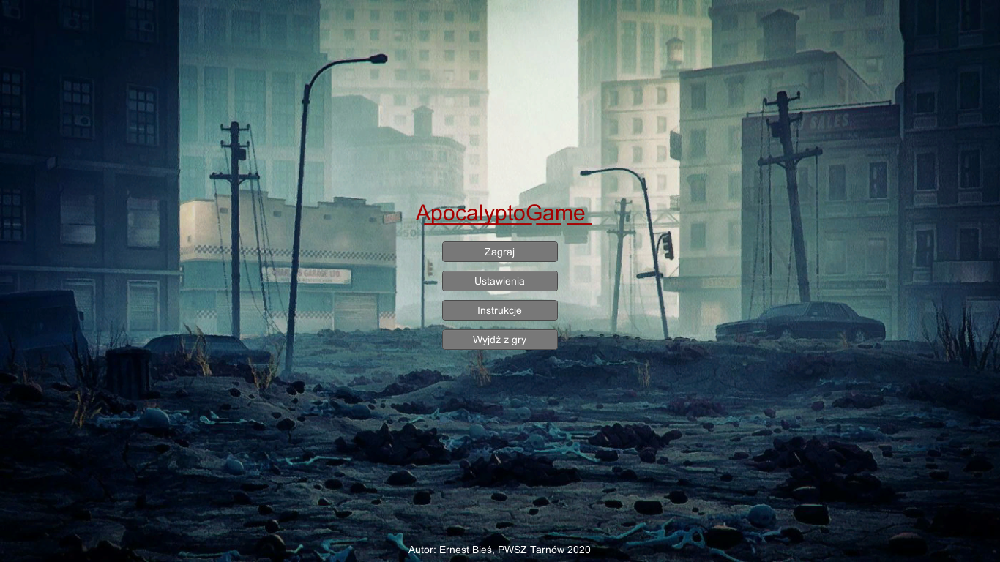
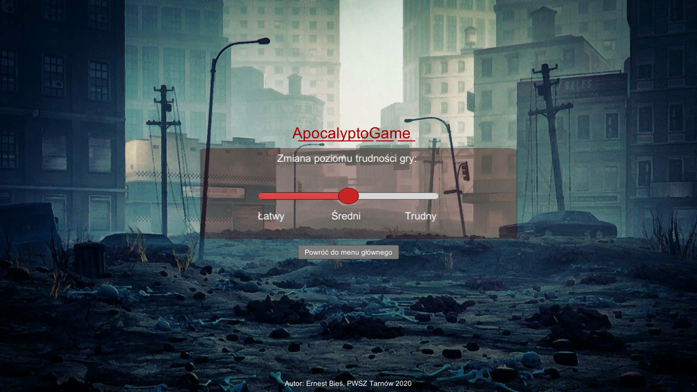
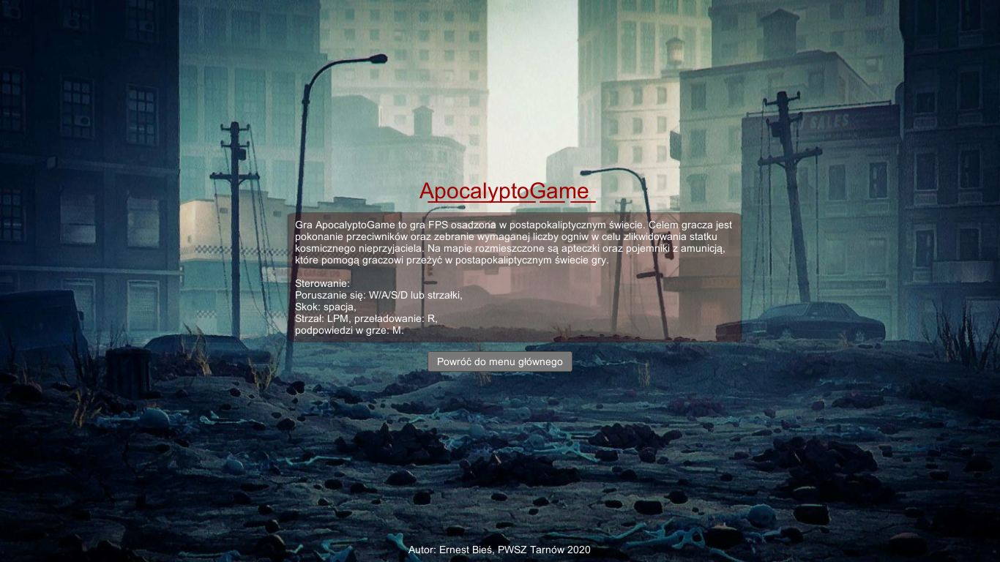
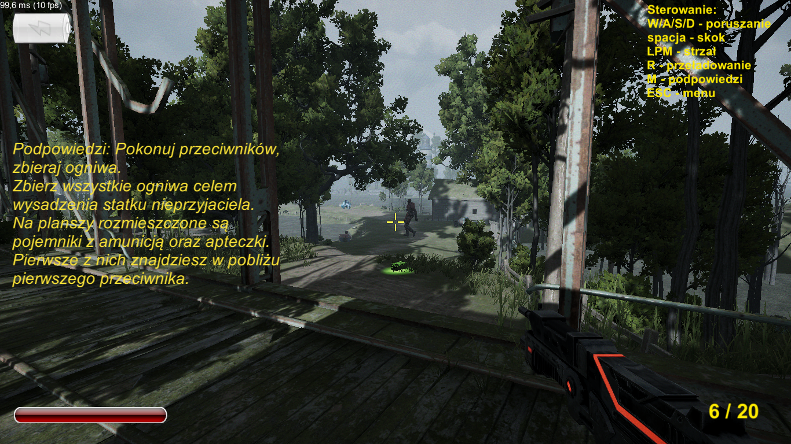
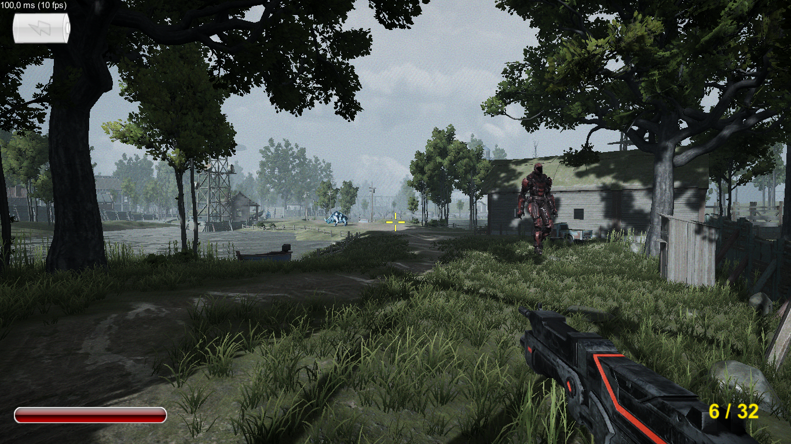

# ApocalyptoGame

The game "ApocalyptoGame" is a first-person shooter, FPS (first-person shooter). There is one main plot of the game in the game, which is not divided into individual levels. In the game, we play the role of a soldier set in a post-apocalyptic world. The player's task is to destroy the enemy ship. The player sees his character from the first-person perspective, has the ability to interact with the environment, can pick up items. In order to destroy a ship, the player must collect four cells that will help him power the generator. The way to get links is different - some of them are located on the map, some of them can be obtained by the player by killing aliens, and the last one is possible after killing the boss. After collecting all the cells, the player can power the generator on the map, which will blow up the enemy ship. There are many opponents on the map who fight both in hand-to-hand and rifle combat. Opponents patrol the area thanks to randomly selected points. During the fight, the player will use a weapon with a limited number of projectiles. There are both ammo containers and first aid kits on the map, thanks to which the player can regain lost health points during combat. Hints in the game help you go through the next stages of the game. The player can choose the difficulty level of the game. There are levels - easy, medium and difficult. Changing the game level affects the experience during the game and is related to the difficulty of defeating the opponents located on the map. The game is a single-player game, designed for Windows systems.

# Technologies
1. C#
2. Unity

# Screenshots
1. Game menu

2. Settings

3. Info

4. Game

